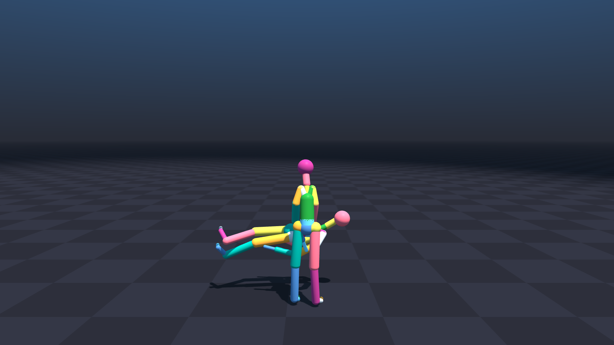

# HHI MJCF Generation Refactor Walkthrough

The procedural generation code in [generate_hhi_mjcf.py](file:///media/rh/codes/sim/newton/hhi_g/generate_hhi_mjcf.py) has been completely refactored into an Object-Oriented structure using a [Body](file:///media/rh/codes/sim/newton/hhi_g/generate_hhi_mjcf.py#13-84) class. This improves maintainability and ensures robust handling of hierarchy and geometry.

## Changes Verified

1.  **OOP Structure**:
    -   Implemented [Body](file:///media/rh/codes/sim/newton/hhi_g/generate_hhi_mjcf.py#13-84) class to encapsulate bone logic, geometry, and BVH data.
    -   Implemented [HHIModelGenerator](file:///media/rh/codes/sim/newton/hhi_g/generate_hhi_mjcf.py#133-388) to handle graph construction and XML generation.
    -   All hierarchy logic is now driven by `BONE_MAPPING` in [hhi_utils.py](file:///media/rh/codes/sim/newton/hhi_g/hhi_utils.py).

2.  **Geometry & Offsets**:
    -   **Parent Body Geom**: Standard bone geometries (capsules) are correctly placed in the *parent* body's XML element.
    -   **Element Order**: Link Geometries are now nested *inside* the Body element, matching standard conventions and ensuring local rotation.
    -   **Kinematic Logic**: Adopted the logic where Body Position matches the **Parent's Offset**, and Geometry Length matches the **Current Offset**. This effectively places the Body frame at the *start* of the segment (Parent Joint) rather than the end.
    -   **Head Sphere**: Vertical placement verified. The generated sphere is centered at `0.5 * Offset` with `Radius = 0.5 * Offset`, ensuring its top (tip) exactly reaches the EndSite offset as requested.
    -   **Angle Ordering**: Implemented child body sorting by BVH index. This ensures that the generated XML structure (which dictates the joint order in Newton/MuJoCo) perfectly aligns with the BVH data channels, guaranteeing correct motion playback.
    -   **Statistics**: Added automatic calculation and printing of **Total Character Mass** (approx. 49kg) and **Link Lengths** (in cm) during generation, using the Geom/Link name for clarity.

3.  **Visualization Fixes**:
    -   Updated [run_hhi_vis.py](file:///media/rh/codes/sim/newton/hhi_g/run_hhi_vis.py) to correctly parse and load included XML files from the scene file, bypassing a limitation in the Newton simulator's MJCF parser.
    -   Verified that the simulation loads with 134 DOFs (67 per robot).
    -   Adjusted camera position (backed out to Y=-4.5m) to ensure full body visibility including feet.

## Visual Verification

The following preview shows the generated models in the Newton simulator (Static Pose at Frame 0):



## Validation Commands Run

```bash
# Generate MJCFs
uv run python generate_hhi_mjcf.py

# Run Visualization (Static)
uv run python run_hhi_vis.py --headless --static --start-frame 0
```

## Key Files
- [generate_hhi_mjcf.py](file:///media/rh/codes/sim/newton/hhi_g/generate_hhi_mjcf.py): New OOP implementation.
- [hhi_utils.py](file:///media/rh/codes/sim/newton/hhi_g/hhi_utils.py): Contains [Body](file:///media/rh/codes/sim/newton/hhi_g/generate_hhi_mjcf.py#13-84) mapping and [get_radius](file:///media/rh/codes/sim/newton/hhi_g/hhi_utils.py#94-97) helper.
- [run_hhi_vis.py](file:///media/rh/codes/sim/newton/hhi_g/run_hhi_vis.py): Patched visualization script.
